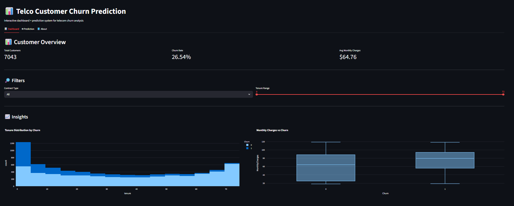
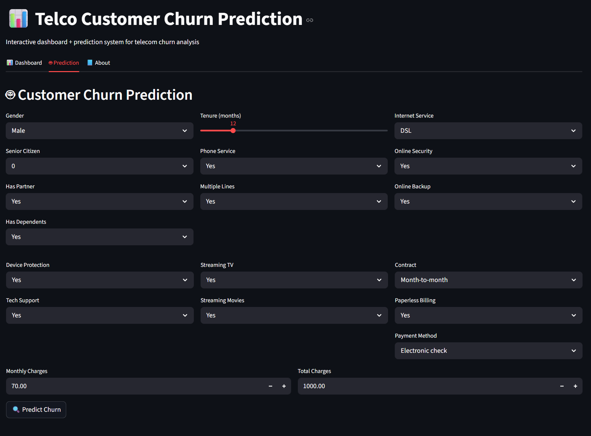
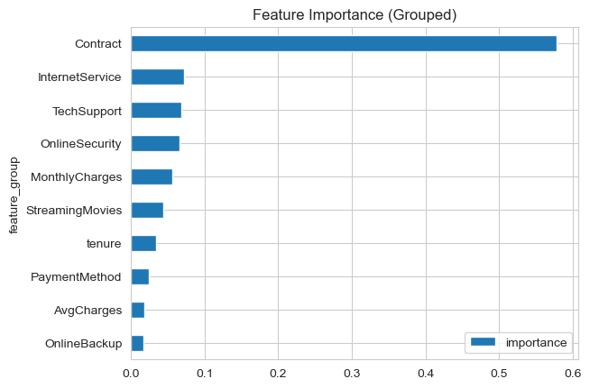

# 📊 Telco Customer Churn Prediction (ML + Streamlit Dashboard)

## 📌 Problem Statement

Customer churn is a major challenge in the telecom industry.
Acquiring new customers is significantly more expensive than retaining existing ones.

This project aims to **predict customer churn probability**, enabling businesses to take **proactive retention actions** and reduce revenue loss.

---

## 🎯 Objective

* Build a machine learning model to predict customer churn
* Identify key factors influencing churn behavior
* Deploy an interactive dashboard for real-time prediction

---

## 🧠 Machine Learning Approach

### Models Evaluated

* Logistic Regression
* Decision Tree
* Random Forest
* K-Nearest Neighbors (KNN)
* Support Vector Machine (SVM)
* XGBoost ✅ *(Final Selected Model)*

---

## 📊 Model Comparison (After Hyperparameter Tuning)

| Model               | CV Score | CV Std | Recall    | ROC-AUC   |
| ------------------- | -------- | ------ | --------- | --------- |
| XGBoost ✅           | 0.946    | 0.0127 | **0.947** | 0.837     |
| SVM                 | 0.835    | 0.0191 | 0.821     | 0.823     |
| Random Forest       | 0.810    | 0.0241 | 0.799     | 0.840     |
| Logistic Regression | 0.799    | 0.0368 | 0.783     | **0.846** |
| Decision Tree       | 0.773    | 0.0252 | 0.759     | 0.831     |
| KNN                 | 0.559    | 0.0107 | 0.575     | 0.813     |

---

### 🧠 Model Selection Rationale

Although Logistic Regression achieved the highest ROC-AUC (0.846),
**XGBoost was selected as the final model** because:

* It achieved the **highest Recall (0.947)** → critical for detecting churn customers
* It delivered the **best cross-validation score (0.946)**
* It showed **low variance (CV std = 0.0127)** → stable performance

> 🎯 In churn prediction, **Recall is prioritized over ROC-AUC**,
> because missing a churn customer (false negative) has a higher business cost.

---

## 📈 Key Insights

* 📉 **Month-to-month contracts** have the highest churn rate
* 💰 **Higher monthly charges** increase churn probability
* ⏳ **Low tenure customers** are more likely to churn
* 🛠️ Lack of **tech support / online security** increases churn risk

---

## 🖥️ Streamlit App Features

### 📊 Dashboard

* Customer overview with KPI metrics
* Interactive filters (contract, tenure)
* Visual insights (tenure distribution, charges vs churn)

### 🤖 Prediction System

* Manual customer input form
* Real-time churn prediction
* Probability score with risk interpretation

### 📊 Explainability

* Feature importance visualization
* Grouped feature insights (business-level interpretation)

---

## 📷 Screenshots

### 📊 Dashboard



### 🤖 Prediction Page



### 📊 Feature Importance



---

## 💼 Business Impact

* Enables **early identification of at-risk customers**
* Supports **targeted retention strategies**
* Reduces **customer acquisition costs**
* Improves **Customer Lifetime Value (CLV)**

---

## ⚠️ Limitations

* Dataset imbalance handled using SMOTE
* Model may not generalize across all telecom providers

---

## 🚀 How to Run the Project

### 1. Clone Repository

```bash
git clone https://github.com/Eusford08/TelcoChurnPrediction.git
cd TelcoChurnPrediction
```

### 2. Install Dependencies

```bash
pip install -r requirements.txt
```

### 3. Run Streamlit App

```bash
streamlit run app.py
```

---

## 📂 Project Structure

```
TelcoChurnPrediction/
│
├── app.py                  # Streamlit app
├── requirements.txt
├── README.md
│
├── data/                   # Dataset
├── model/                  # Trained model (.pkl)
├── src/
│   └── cleaning.py         # Data cleaning
│   └── features.py         # Feature engineering
│   └── preprocessing.py    # Feature preprocessing
│
├── notebooks/              # EDA & experiments
└── images/                 # Screenshots
```

---

## 🔧 Tech Stack

* Python
* Pandas / NumPy
* Scikit-learn
* Imbalanced-learn (SMOTE)
* XGBoost
* Plotly
* Streamlit

---

## 📌 Future Improvements

* Add SHAP explainability for local predictions
* Hyperparameter tuning with advanced search

* Build REST API using FastAPI

---

## 👤 Author

**Jackson Lee**
Aspiring Data Scientist | Machine Learning Practitioner

---

## ⭐ Support

If you found this project useful, consider giving it a ⭐ on GitHub!
